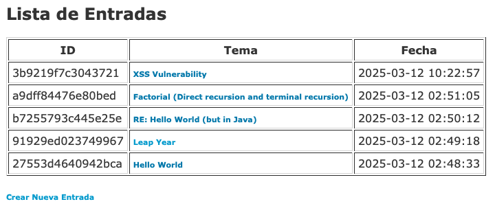
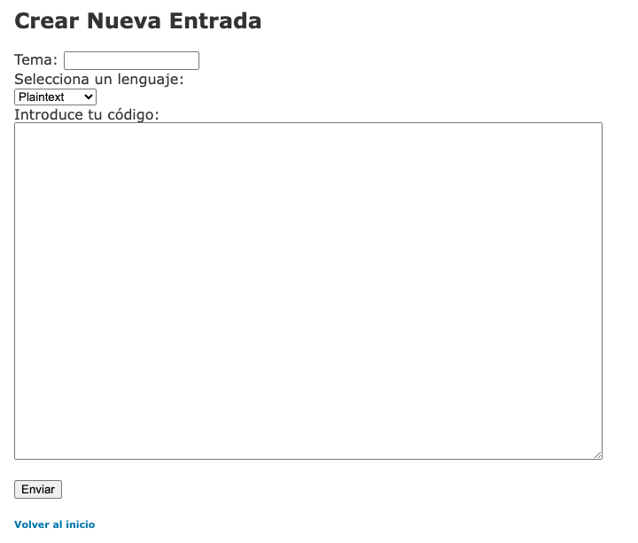
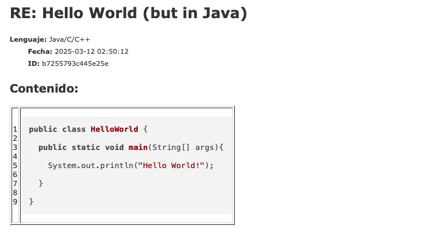
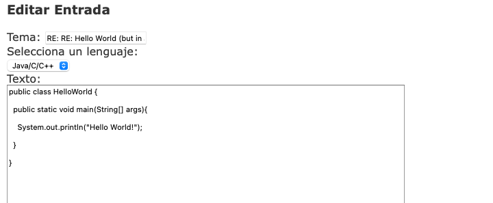
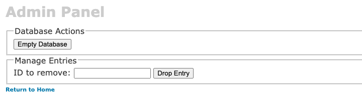

# Open Pastebin NG

**Open Pastebin NG** is an easy-to-use utility for sharing text and code through the web. It supports plain text as well as syntax highlighting for **PHP, Ruby, Bash, Python, Java/C/C++ and more**. See the feature list below for more details.

This project is based on **[Open Pastebin](http://sourceforge.net/projects/openpastebin/)**. All you need is a **web server with PHP and MySQL**.
Open Pastebin NG is **free software** released under the **[GNU GPL license](LICENSE)**.

⚠️ **This software is in BETA stage**, wich means it is still under development. Use it at your own risk.

---

## ✨ Features
- ✅ Simple and clean user interface
- ⚡️ Fast performance (no heavy images or media, just text)
- 🎨 Syntax highlighting for multiple programming languages
- 🔓 Secure authentication system for administrative actions and role-based access control
- 👤 User management: **Admin**, **Registered User**, and **Guest**  
- 🛡️ CSRF protection for sensitive actions
- 📂 Entries are stored in a **MySQL database**

---

## 🖼️ Screenshots

### 📌 Homepage (List of Pastes)

### 📌 Create a New Paste

### 📌 View a Paste with Syntax Highlighting

### 📌 Edit a Paste

### 📌 Admin Panel

---

## 🛠️ Requirements
To run Open Pastebin NG, you need:

- **PHP 7.4** or higher
- **MySQL 5.7** or MariaDB
- A web server (**Apache, Nginx or similar**)

---

## 🚀 Installation
Follow this steps to install Open Pastebin NG:

1️⃣ **Clone the repository**

	git clone https://github.com/emilio-devesa/opng.git
	cd opng

2️⃣ **Configure the database**
Edit config.php and set your database credentials, for example:

	$mysql_server = "localhost";
	$mysql_username = "root";
	$mysql_password = "yourpassword";
	$mysql_dbname = "opng";

3️⃣ **Run the application**
- If using **Apache**, place the project in `htdocs` or configure a virtual host.
- If using **Nginx**, configure the root directory in your Nginx config.
- Open `http://localhost/` in your browser.

---

## 📌 Usage
From the homepage you can:

- 📝 **Create a new paste**: Enter your text or code, select a language and submit.
- 🔍 **View and edit a paste**: Click on the topic you want to view/edit
- 🛠️ **Manage pastes (Admin panel)**: Log in to `admin/admin.php` to drop entries or delete the entire database.

For security reasons, access to **admin features** is password-protected.
Default password: `demo` (you should change it in `login.php`)

---

## 🔒 User Roles & Permissions
👤 Guest
- Can view public pastes
- Can create pastes (anonymous pastes)
- Cannot delete any pastes

📝 Registered User
- Can create and manage their own pastes
- Can delete only their own pastes
- Cannot access the admin panel

🛠️ Administrator
- Has full control over the system
- Can delete any paste (even from other users)
- Can empty the database via the admin panel

---

## ❓FAQ

### 🔷 Is it possible to share files, images, or binary files?
No, **Open Pastebin NG** is designed to share plain text and source code only. It does not support file uploads, images, or binary files.

### 🔷 How many pastes can I create? Is there any limitation?
There is no built-in limit on the number of pastes you can create. However, limitations may exist depending on:

- Your **server storage capacity**
- **Database size restrictions** set by your hosting provider

### 🔷 Where is my data stored? Is it private and safe?
Your pastes are stored in a **MySQL database** on your web server. Security depends on:

- Your **server configuration** (firewalls, database access, etc.)
- Proper use of **server permissions**
- Whether you enable **HTTPS** for secure connections

By default, **pastes are public** and **Open Pastebin NG does not support password-protected pastes** at the moment.
If this is an essential feature, consider submitting a **feature request**.
However, **registered users** can manage and delete their own pastes.

### 🔷 Is Open Pastebin NG available in more languages?
Yes! Open Pastebin NG supports multiple languages.
Currently available:
- 🇬🇧 English
- 🇪🇸 Spanish
- 🇩🇪 German
- 🇫🇷 French
- 🇵🇹 Portuguese
- 🇨🇳 Chinese

### 🔷 Can I download, fork, modify, and/or share again Open Pastebin NG?
Yes! **Open Pastebin NG** is **free and open-source software**, licensed under the **[GNU GPL](LICENSE)**.
You can:

- **Download** and install it on your server
- **Modify** it to fit your needs
- **Fork** the project and contribute improvements
- **Share** your version with the community

### 🔷 I found a bug and I lost my work!
I'm sorry to hear that! Please note that **OPNG is still in BETA stage and under development**. Please report the issue so we can fix it.

### 🔷 How can I uninstall OPNG and/or delete all data stored?
To completely remove Open Pastebin NG, follow these steps:

1. **Empty the database** from the administration panel
2. **Delete all files** from your server
3. **Clear your browser cache** if neccesary

This will remove **all pastes and files permanently**.

🚀 **Need more help?** Feel free to open an issue or reach out.

---

## ✅ Known Issues
Currently, there are no known issues. However, as this is a **BETA release**, some unexpected bugs may still exist.

---

🔷 **Found a bug?**
If you encounter any issue, please report it by:

- Opening an issue on Github
- Submitting a pull request with a fix

Your feedback is highly appreciated!

---

## 📜 License
Released under [GNU GENERAL PUBLIC LICENSE](LICENSE)
Version 2, June 1991 -  or later

You are free to use, modify, and distribute this software under the terms of the GPL.
NOTE! THIS IS EXPERIMENTAL SOFTWARE MEANT ONLY FOR TESTING! USE AT YOUR OWN RISK!
I assume no responsibility for any damages if you choose to ignore the abovementioned warning

---

## 🛠️ Credits & Acknowledgments
This project is based on **Open Pastebin**, originally developed by:
**Ville Särkkälä** - villeveikko@users.sourceforge.net
